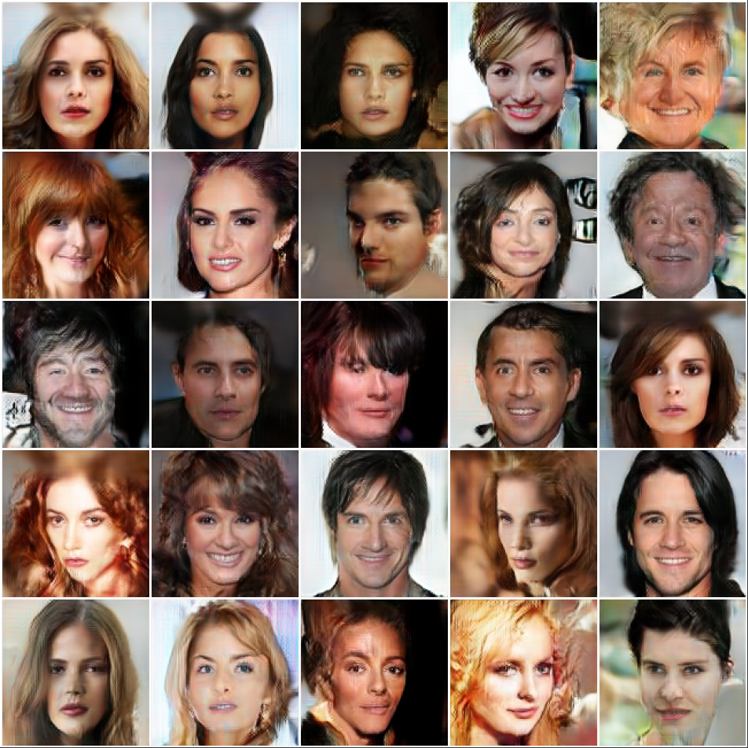
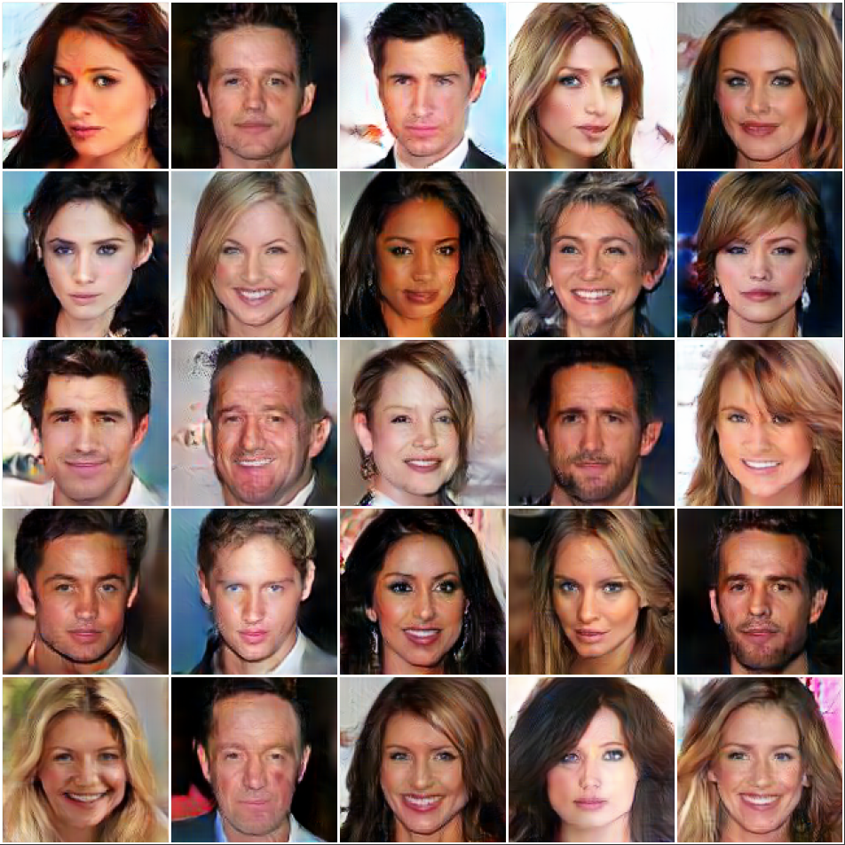
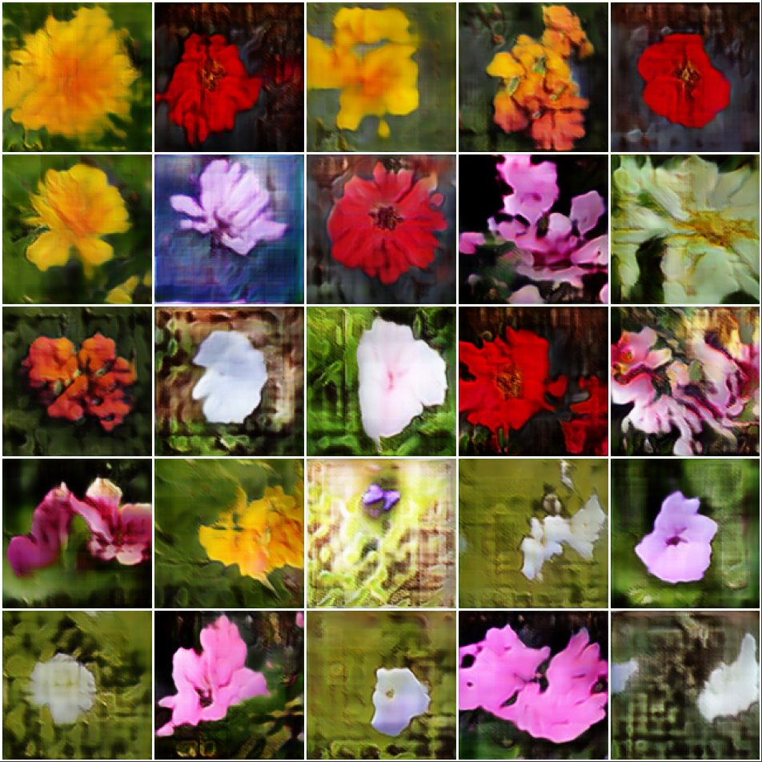
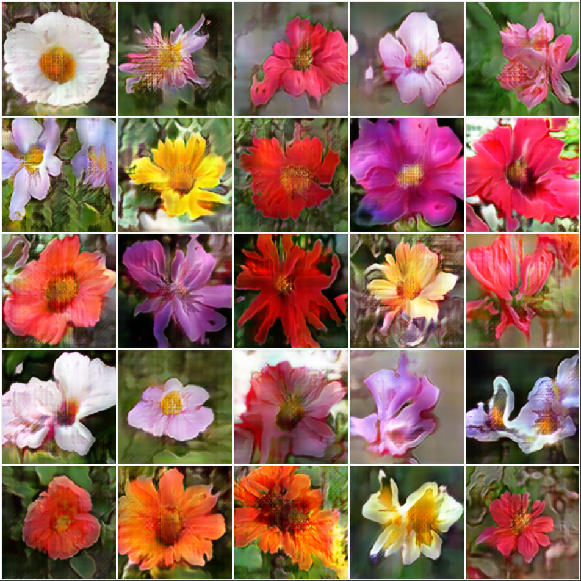
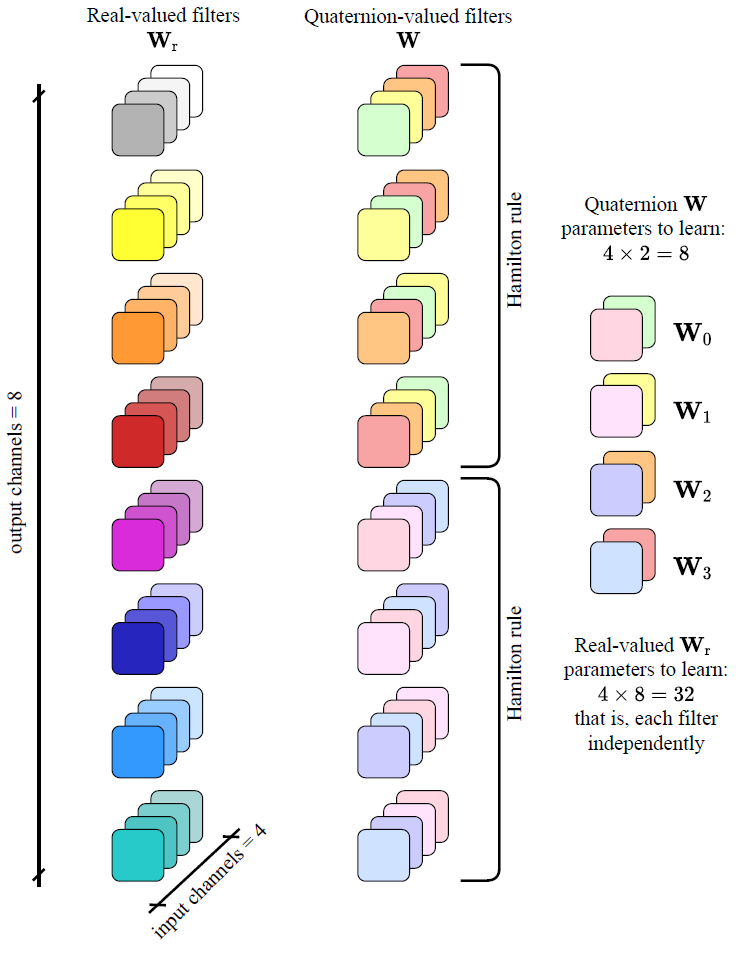

# Quaternion Generative Adversarial Networks
Official PyTorch repository for:

Eleonora Grassucci, Edoardo Cicero, Danilo Comminiello, "[Quaternion Generative Adversarial Networks](https://arxiv.org/pdf/2104.09630.pdf)", <i>[Generative Adversarial Learning: Architectures and Applications](https://link.springer.com/book/10.1007/978-3-030-91390-8#toc)</i>, editors:  Dr Roozbeh Razavi-Far, Dr Ariel Ruiz-Garcia, Professor Vasile Palade, Professor Jürgen Schmidhuber, Springer, Sept. 2021.

### Abstract

Latest Generative Adversarial Networks (GANs) are gathering outstanding results through a large-scale training, thus employing models composed of millions of parameters requiring extensive computational capabilities. Building such huge models undermines their replicability and increases the training instability. Moreover, multi-channel data, such as images or audio, are usually processed by real-valued convolutional networks that flatten and concatenate the input, losing any intra-channel spatial relation. To address these issues, here we propose a family of quaternion-valued generative adversarial networks (QGANs). QGANs exploit the properties of quaternion algebra, e.g., the Hamilton product for convolutions. This allows to process channels as a single entity and capture internal latent relations, while reducing by a factor of 4 the overall number of parameters. We show how to design QGANs and to extend the proposed approach even to advanced models. We compare the proposed QGANs with real-valued counterparts on multiple image generation benchmarks. Results show that QGANs are able to generate visually pleasing images and to obtain better FID scores with respect to their real-valued GANs. Furthermore, QGANs save up to 75% of the training parameters. We believe these results may pave the way to novel, more accessible, GANs capable of improving performance and saving computational resources.

### Results

Summary parameters and memory results for SNGAN and QSNGAN.

| Model  | # Total parameters | Disk Memory^|
|--------|:------------------:|:---------:|
| SNGAN  |     61,173,000     |   115 GB  |
| QSNGAN |     16,896,105     |   35 GB   |

^ Memory required by the generator checkpoint for inference.

Samples generated from the real-valued SNGAN on the left and from the proposed Quaternion-valued QSNGAN on the right on the CelebA-HQ dataset and 102 Oxford Flowers dataset.

          

          


### Training

The files `SNGAN_128.txt` and `QSNGAN_128.txt` contain the configurations and options for training.

Please install the `requirements.txt` file. Download the dataset and set the name and the path in the `.txt` configuration file. Images are resized by default to 128x128 if not set differently. Default Dataloaders are set up for CelebA-HQ, 102 Oxford Flowers and CIFAR10. For the latter set `image_size=32` and the model either `SNGAN_32` or `QSNGAN_QSN_32`.

Training can be performed through:

```python
python Qmain_FromText.py --TextArgs=*choose-the-txt-file*
```

### Quaternion convolution visualized



Quaternion convolutions adjust the kernels of the convolution to reproduce the Hamilton product. The figure above shows real-valued filters and wuaternion-valued filters for a generic layer with 4 channels in input and 8 channels in output. In the figure you can see how the real-valued convolution needs a different filter for each input channel, while quaternion convolution share the filters among inputs. You can found a detailed description in the [paper](https://arxiv.org/pdf/2104.09630.pdf).


### Cite

Please cite our work if you found it useful:

```
@article{grassucci2021quaternion,
      title={Quaternion Generative Adversarial Networks}, 
      author={Grassucci, Eleonora and Cicero, Edoardo and Comminiello, Danilo},
      year={2021},
      eprint={2104.09630},
      archivePrefix={arXiv},
      primaryClass={cs.LG}
}
```

#### Interested in Quaternion Generative Models?

Check also: 

* Lightweight Convolutional Neural Network by Hypercomplex Parameterization, Under Review at ICLR2021, 2021 [[Paper](https://arxiv.org/pdf/2110.04176.pdf)] [[GitHub](https://github.com/elegan23/hypernets)].
* Quaternion-Valued Variational Autoencoder, ICASSP, 2021 [[Paper](https://arxiv.org/pdf/2010.11647.pdf)] [[GitHub](https://github.com/eleGAN23/QVAE)].
* An Information-Theoretic Perspective on Proper Quaternion Variational Autoencoders, Entropy, 2021 [[Paper](https://www.mdpi.com/1099-4300/23/7/856)] [[GitHub](https://github.com/eleGAN23/QVAE)].


